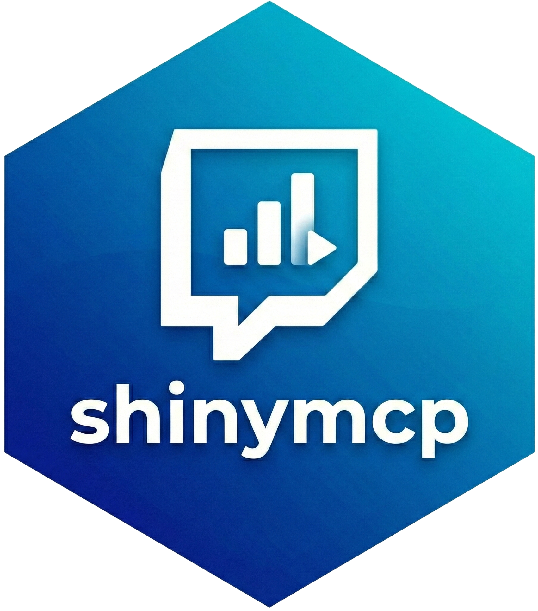
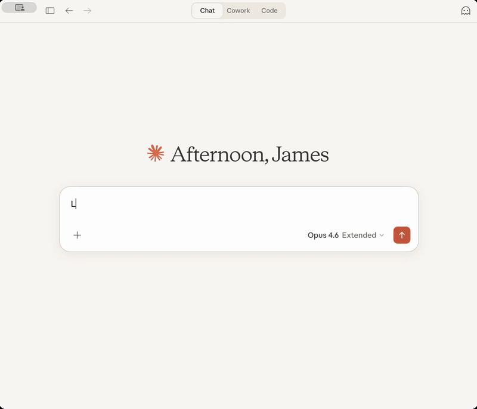

<!-- README.md is generated from README.Rmd. Please edit that file -->

# shinymcp <a href="https://jameshwade.github.io/shinymcp/"></a>

<!-- badges: start -->

[](https://lifecycle.r-lib.org/articles/stages.html#experimental)
[](https://CRAN.R-project.org/package=shinymcp)
[](https://github.com/JamesHWade/shinymcp/actions/workflows/R-CMD-check.yaml)
[](https://app.codecov.io/gh/JamesHWade/shinymcp)
<!-- badges: end -->

<div class="shinymcp-hero" aria-label="shinymcp overview">



<div class="shinymcp-hero-copy">

<p class="shinymcp-eyebrow">

Shiny apps inside AI chat
</p>

<h2>

Turn live Shiny workflows into MCP Apps.
</h2>

<p>

shinymcp converts Shiny interfaces and R computations into MCP Apps:
interactive cards that can run in chat clients, Shiny hosts, and
shinychat conversations.
</p>

<div class="shinymcp-actions">

<a class="btn btn-primary" href="#quick-start">Get
started</a><a class="btn btn-outline-primary" href="https://jameshwade.github.io/shinymcp/articles/use-cases.html">See
use
cases</a><a class="btn btn-outline-secondary" href="https://jameshwade.github.io/shinymcp/articles/use-shinymcp-with-shinychat.html">Use
with shinychat</a>

</div>

</div>

</div>

<div class="shinymcp-signal-row" aria-label="shinymcp capabilities">

<div>

<strong>ui:// resources</strong>Declare HTML app surfaces for MCP hosts.

</div>

<div>

<strong>postMessage bridge</strong>Keep inputs, tool calls, and results
synchronized.

</div>

<div>

<strong>Shiny hosting</strong>Embed MCP Apps as full-screen-capable
Shiny cards.

</div>

</div>

## Start with a path

<div class="shinymcp-path-grid">

<a class="shinymcp-path-card" href="#quick-start"><strong>Build</strong>
<h3>

Create an MCP App directly
</h3>

<p>

Use Shiny or bslib inputs, add MCP output targets, and bind them to R
tools.
</p>

</a><a class="shinymcp-path-card" href="https://jameshwade.github.io/shinymcp/articles/converting-shiny-apps.html"><strong>Convert</strong>
<h3>

Move an existing Shiny app
</h3>

<p>

Flatten reactive groups into tool functions while keeping the
user-facing workflow.
</p>

</a><a class="shinymcp-path-card" href="https://jameshwade.github.io/shinymcp/articles/use-shinymcp-with-shinychat.html"><strong>Integrate</strong>
<h3>

Render apps inside shinychat
</h3>

<p>

Return rich MCP cards from chat tools, including state sync and
full-screen mode.
</p>

</a>

</div>

## Installation

You can install the development version of shinymcp from
[GitHub](https://github.com/) with:

``` r
# install.packages("pak")
pak::pak("JamesHWade/shinymcp")
```

## Quick start

An MCP App has two parts: **UI components** that render in the chat
interface, and **tools** that run R code when inputs change. Use
standard shiny or bslib inputs — the bridge auto-detects them by
matching tool argument names to element `id` attributes.

``` r
library(shinymcp)
library(bslib)

ui <- page_sidebar(
  theme = bs_theme(preset = "shiny"),
  title = "Dataset Explorer",
  sidebar = sidebar(
    # Standard shiny input — auto-detected because id matches tool arg "dataset"
    shiny::selectInput("dataset", "Choose dataset", c("mtcars", "iris", "pressure"))
  ),
  card(
    card_header("Summary"),
    mcp_text("summary")
  )
)

tools <- list(
  ellmer::tool(
    fun = function(dataset = "mtcars") {
      data <- get(dataset, envir = asNamespace("datasets"))
      paste(capture.output(summary(data)), collapse = "\n")
    },
    name = "get_summary",
    description = "Get summary statistics for the selected dataset",
    arguments = list(
      dataset = ellmer::type_string("Dataset name")
    )
  )
)

app <- mcp_app(ui, tools, name = "dataset-explorer")
serve(app)
```

Save this as `app.R`, then register it in your Claude Desktop config:

``` json
{
  "mcpServers": {
    "dataset-explorer": {
      "command": "Rscript",
      "args": ["/path/to/app.R"]
    }
  }
}
```

Restart Claude Desktop. When the tool is invoked, an interactive UI
appears inline in the conversation. Changing the dropdown calls the tool
and updates the output — no page reload needed.

If nothing renders, see `vignette("debugging-shinymcp")` — the most
common cause is a host that doesn’t support the MCP Apps extension yet.

### Where MCP Apps run

MCP Apps is an optional MCP extension
([spec](https://github.com/modelcontextprotocol/ext-apps)) that hosts
must opt into. Your tools degrade gracefully: **in any MCP client they
work as ordinary text tools; the interactive UI lights up where the host
supports MCP Apps.**

| Host | Interactive UI |
|----|----|
| Claude Desktop / claude.ai | ✅ (MCP Apps support rolling out) |
| ChatGPT (apps) | ✅ |
| `preview_app()` — local browser preview | ✅ reference host with protocol log |
| Shiny / shinychat via `mcp_embed()` | ✅ |
| Any other MCP client (no apps extension) | text-only tools, still fully functional |

A second thing you get for free: as the user interacts with the rendered
UI, the bridge pushes the current input state into the model’s context
(`ui/update-model-context`). **The model sees what the user did in the
app and can act on it in the next turn** — that’s what makes MCP Apps
more than embedded dashboards.

## Converting a Shiny app

The core idea: **flatten your reactive graph into tool functions**.

Each connected group of inputs → reactives → outputs becomes a single
tool that takes input values as arguments and returns a named list of
outputs.

``` r
# --- Shiny ---
server <- function(input, output, session) {
  filtered <- reactive({
    penguins[penguins$species == input$species, ]
  })
  output$scatter <- renderPlot({
    ggplot(filtered(), aes(x, y)) + geom_point()
  })
  output$stats <- renderPrint({
    summary(filtered())
  })
}

# --- MCP App tool ---
ellmer::tool(
  fun = function(species = "Adelie") {
    filtered <- penguins[penguins$species == species, ]

    # Render plot to base64 PNG
    tmp <- tempfile(fileext = ".png")
    ggplot2::ggsave(tmp, my_plot, width = 7, height = 4, dpi = 144)
    on.exit(unlink(tmp))

    list(
      scatter = base64enc::base64encode(tmp),
      stats = paste(capture.output(summary(filtered)), collapse = "\n")
    )
  },
  name = "explore",
  description = "Filter and visualize penguins",
  arguments = list(
    species = ellmer::type_string("Penguin species")
  )
)
```

Return keys (`scatter`, `stats`) must match output IDs in the UI
(`mcp_plot("scatter")`, `mcp_text("stats")`). The bridge routes each
value to the correct output element.

For a full worked example converting a Shiny app step-by-step, see
`vignette("converting-shiny-apps")`.

## Automatic conversion

shinymcp includes a parse-analyze-generate pipeline that can scaffold an
MCP App from an existing Shiny app:

``` r
convert_app("path/to/my-shiny-app")
```

This parses the UI and server code, maps the reactive dependency graph
into tool groups, and writes a working MCP App with tools, components,
and a server entrypoint. The generated tool bodies contain placeholders
that you fill in with the actual computation logic.

For details, see `vignette("automatic-conversion")`.

### AI-assisted conversion

For complex Shiny apps, shinymcp ships a
[deputy](https://github.com/JamesHWade/deputy) skill that guides an AI
agent through the conversion process. The skill handles dynamic UI,
modules, file uploads, and other patterns that require human judgment.
See `inst/skills/convert-shiny-app/SKILL.md` for the full instructions.

## Component reference

### Inputs: use standard shiny/bslib

The bridge auto-detects standard form elements (`<select>`, `<input>`,
etc.) whose `id` matches a tool argument name. This means you can use
the Shiny and bslib inputs you already know:

``` r
sidebar(
  shiny::selectInput("species", "Species", choices),
  shiny::numericInput("n", "Count", value = 10),
  shiny::checkboxInput("trend", "Show trend line")
)
```

For edge cases (id doesn’t match arg name, custom widgets), use
`mcp_input()` to explicitly mark an element:

``` r
mcp_input(shiny::radioButtons("fmt", "Format", c("summary", "head")), id = "fmt")
```

shinymcp also provides lightweight `mcp_select()`, `mcp_text_input()`,
etc. that generate minimal HTML without Shiny’s JS runtime. These are
useful for simple apps and are what the automatic conversion pipeline
generates.

### Outputs

| Shiny | shinymcp | Notes |
|----|----|----|
| `textOutput()` / `verbatimTextOutput()` | `mcp_text()` | Renders in `<pre>` with monospace font |
| `plotOutput()` | `mcp_plot()` | Tool returns base64-encoded PNG |
| `tableOutput()` | `mcp_table()` | Tool returns HTML table string |
| `htmlOutput()` | `mcp_html()` | Tool returns raw HTML |

You can also turn any tag into an output target with `mcp_output()`:

``` r
mcp_output(tags$pre(id = "result"), type = "text")
```

### External assets and CSP

MCP hosts apply a restrictive Content Security Policy to the app iframe:
**external scripts, stylesheets, fonts, and network requests are blocked
by default, and they fail silently.** shinymcp sidesteps this by
inlining all CSS/JS dependencies into the HTML resource and sending
plots as base64 — stick to that model and you never hit it. If your app
genuinely needs external domains (a CDN-loaded htmlwidget, client-side
API calls), declare them so hosts can allow them:

``` r
mcp_app(
  ui, tools,
  name = "my-app",
  csp = list(
    connect_domains = "https://api.example.com",
    resource_domains = "https://cdn.jsdelivr.net"
  )
)
```

See `vignette("mcp-apps-protocol")` for the full story.

## Examples

shinymcp ships with example apps:

``` r
# Minimal: mcp_select() + text output
system.file("examples", "hello-mcp", "app.R", package = "shinymcp")

# Native shiny/bslib inputs with auto-detection + mcp_input()/mcp_output()
system.file("examples", "bslib-inputs", "app.R", package = "shinymcp")

# Full dashboard: Palmer Penguins with native shiny inputs, ggplot2, and
# summary statistics
system.file("examples", "penguins", "app.R", package = "shinymcp")

# Use-case gallery: revenue planning, experiment design, incident triage,
# plus a shinychat app that registers each MCP App as a rich tool card
system.file("examples", "use-cases", "app.R", package = "shinymcp")
system.file("examples", "use-cases", "shinychat-app.R", package = "shinymcp")
```

For realistic demo scripts and shinychat integration, see
`vignette("use-cases")` and `vignette("use-shinymcp-with-shinychat")`.

## How it works

MCP Apps render inside sandboxed iframes in the AI chat interface. A
lightweight JavaScript bridge (no npm dependencies) handles
communication via postMessage/JSON-RPC:

1.  User changes an input → bridge auto-detects which form elements are
    inputs (by matching tool argument names to element ids) and collects
    all values
2.  Bridge pushes the input state into the model’s context
    (`ui/update-model-context`) and sends a `tools/call` request to the
    host
3.  Host proxies the call to the MCP server (your R process)
4.  R tool function runs, returns results
5.  Bridge updates output elements with the response

The bridge also implements the MCP Apps initialization handshake
(`ui/initialize`), host theme syncing (light/dark mode follows the chat
client automatically), auto-resize notifications, ping health checks,
and graceful teardown.

shinymcp targets the MCP Apps spec version **2026-01-26**. For a
message-level walkthrough, a compliance table, and the `window.shinymcp`
JS API for custom host interactions (open links, send chat messages,
request fullscreen), see `vignette("mcp-apps-protocol")`.

## Related packages

- [ellmer](https://ellmer.tidyverse.org/) — LLM framework that shinymcp
  uses for tool definitions
- [bslib](https://rstudio.github.io/bslib/) — Bootstrap-based layout and
  theming for the UI
- [mcptools](https://github.com/posit-dev/mcptools) — MCP server
  framework (shinymcp extends this with resource support)
- [deputy](https://github.com/JamesHWade/deputy) — Agentic AI framework
  with a bundled skill for AI-assisted Shiny conversion
