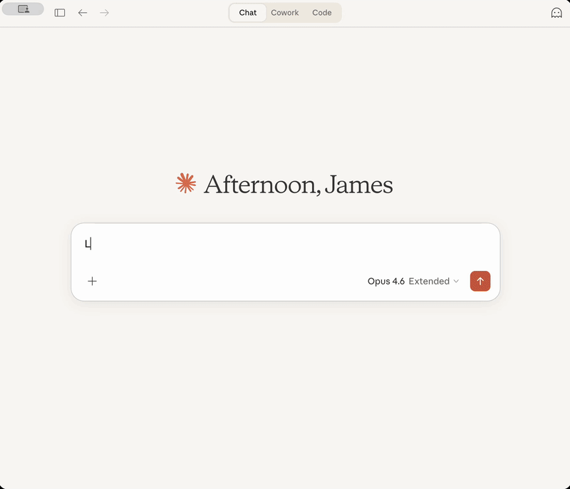

<!-- README.md is generated from README.Rmd. Please edit that file -->

# shinymcp <a href="https://jameshwade.github.io/shinymcp/"></a>

<!-- badges: start -->

[](https://lifecycle.r-lib.org/articles/stages.html#experimental)
[](https://github.com/JamesHWade/shinymcp/actions/workflows/R-CMD-check.yaml)
[](https://app.codecov.io/gh/JamesHWade/shinymcp)
<!-- badges: end -->

shinymcp puts Shiny apps inside AI chat clients. It serves them as [MCP
Apps](https://modelcontextprotocol.io/docs/extensions/apps): a client
that supports the MCP Apps extension, such as Claude, ChatGPT, or VS
Code, shows the app in the conversation, and the model can open it, set
its inputs, and read what it shows. Clients without the extension still
get the app’s tools, which answer in text.



There are two ways to make one:

- **Serve a Shiny app you already have** with `as_mcp_app()`. Its server
  function keeps running in R, one session for each time the app opens,
  so reactive expressions, `renderUI()`, modules, htmlwidgets,
  notifications, and downloads behave as they do in a browser.
- **Build one from R functions** with `mcp_app()`: a page of inputs and
  output placeholders, and tools that fill them. These keep no state
  between calls, and every tool is useful on its own.

## Installation

``` r
# install.packages("pak")
pak::pak("JamesHWade/shinymcp")
```

## Serve a Shiny app

``` r
library(shiny)
library(shinymcp)

ui <- fluidPage(
  sliderInput("bins", "Number of bins", min = 5, max = 50, value = 20),
  plotOutput("histogram"),
  textOutput("caption")
)

server <- function(input, output, session) {
  output$histogram <- renderPlot(hist(faithful$waiting, breaks = input$bins))
  output$caption <- renderText(paste(nrow(faithful), "eruptions"))
}

app <- as_mcp_app(
  shinyApp(ui, server),
  name = "faithful",
  description = "Histogram of waiting times between Old Faithful eruptions."
)
```

`preview_app(app)` opens the app in your browser the way a chat client
shows it, alongside what the model receives from each call.

The model sees one tool, named after the app. Its arguments are the
app’s inputs, so the model can open the app already set up. When it
calls the tool, the chat shows the app and the model reads a summary:

``` r
result <- app$run_tool("faithful", list(bins = 30))
cat(result$content[[1]]$text)
#> The faithful app is open in the conversation (view view-0623b8f7492477bd).
#> 
#> Inputs: bins = 30.
#> 
#> histogram: A plot (640 x 400).
#> 
#> caption: 272 eruptions
```

The plot also reaches the model as an image. From then on the person
using the app works with it directly; each change goes to that view’s
session in R, which sends back the outputs that changed.

## Use it from a chat client

Save the app in a file that ends with `serve(app)` and register the file
with your client. For Claude Desktop, in **Settings \> Developer \> Edit
Config**:

``` json
{
  "mcpServers": {
    "faithful": {
      "command": "Rscript",
      "args": ["/path/to/app.R"]
    }
  }
}
```

Other ways to run an app:

- `serve(app, type = "http")` serves it over HTTP, for clients that
  connect to a URL.
- `mcp_endpoint()` adds an MCP endpoint to a Shiny app, so one
  deployment on Posit Connect or Shiny Server serves people in browsers
  and clients at `/mcp`.
- `as_shinychat_tool()` shows apps as tool results in a
  [shinychat](https://posit-dev.github.io/shinychat/) conversation, and
  `mcp_host_ui()` with `mcp_host_server()` embeds them in any Shiny app.

## Build an app from tools

``` r
datasets <- c("mtcars", "faithful", "airquality")

summarize_dataset <- ellmer::tool(
  function(dataset = "mtcars") {
    data <- getExportedValue("datasets", dataset)
    list(summary = paste(capture.output(summary(data)), collapse = "\n"))
  },
  name = "summarize_dataset",
  description = "Summarize one of R's built-in datasets, column by column.",
  arguments = list(
    dataset = ellmer::type_enum(datasets, "The dataset to summarize.")
  )
)

app <- mcp_app(
  ui = htmltools::tagList(
    mcp_select("dataset", "Dataset", datasets),
    mcp_text("summary")
  ),
  tools = list(summarize_dataset),
  name = "summary"
)
```

Tool arguments match inputs by id, and the names of the list a tool
returns match outputs. When the person picks another dataset, the page
calls the tool and fills in the result. The model can call the same
tool, with or without a client that shows the app.

Results can hold text, tables, plots, images, HTML, and htmlwidgets.
Each result is split three ways: text and compact structured data for
the model, and the data the page draws from, in `_meta`, which clients
keep from the model.

## What works

The page is the app’s UI with shinymcp’s JavaScript in place of Shiny’s.
It draws Shiny’s inputs and every kind of output: text, tables, plots,
`renderUI()`, and htmlwidgets such as plotly, DT, and leaflet. Packages
written for Shiny’s JavaScript work too, including shinyWidgets inputs,
DT row selection, `plotly::event_data()`, shinyjs, and shinycssloaders.
Downloads, file uploads, modals, notifications, and `invalidateLater()`
work as they do in a browser.

What doesn’t carry over is anything from another website, such as map
tiles or a script from a CDN, unless the app declares it: chat clients
block the rest. `vignette("shiny-apps")` has the details.

## Learn more

- [Get
  started](https://jameshwade.github.io/shinymcp/articles/shinymcp.html):
  a first app, from preview to Claude Desktop.
- [Serving a Shiny
  app](https://jameshwade.github.io/shinymcp/articles/shiny-apps.html):
  views and sessions, and what the model sees and knows.
- [Building an app from
  tools](https://jameshwade.github.io/shinymcp/articles/tools.html).
- [Running an
  app](https://jameshwade.github.io/shinymcp/articles/deployment.html):
  chat clients, HTTP, and Posit Connect.
- [Apps in shinychat and
  Shiny](https://jameshwade.github.io/shinymcp/articles/hosting.html).
- [Rewriting an app as
  tools](https://jameshwade.github.io/shinymcp/articles/rewriting-as-tools.html).
- [How shinymcp
  works](https://jameshwade.github.io/shinymcp/articles/protocol.html).
- [Troubleshooting](https://jameshwade.github.io/shinymcp/articles/troubleshooting.html).

The
[examples](https://github.com/JamesHWade/shinymcp/tree/main/inst/examples)
folder has runnable apps for each of these.

shinymcp also comes with a
[skill](https://github.com/JamesHWade/shinymcp/tree/main/inst/skills/convert-shiny-app)
that walks a coding agent through serving or rewriting a Shiny app. For
Claude Code, copy its folder,
`system.file("skills", "convert-shiny-app", package = "shinymcp")`, into
`~/.claude/skills/`.
